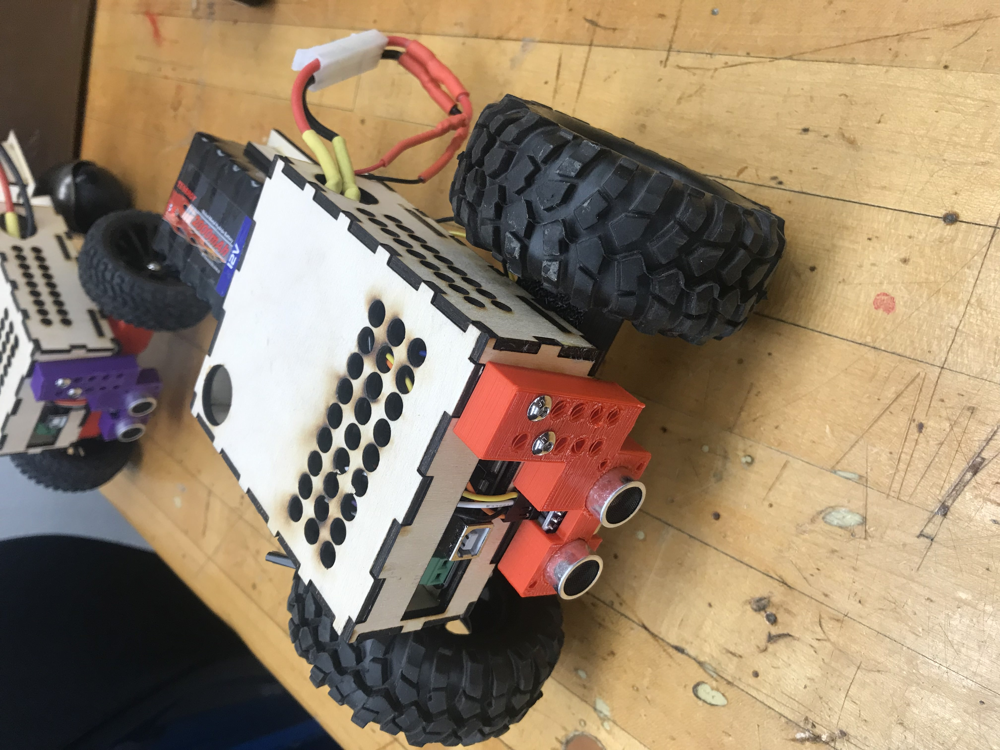
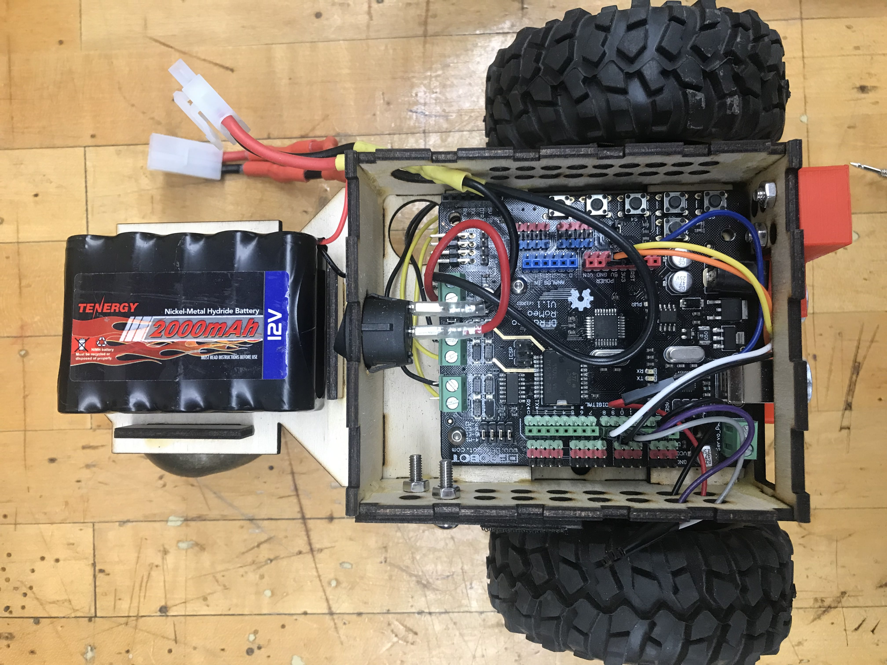
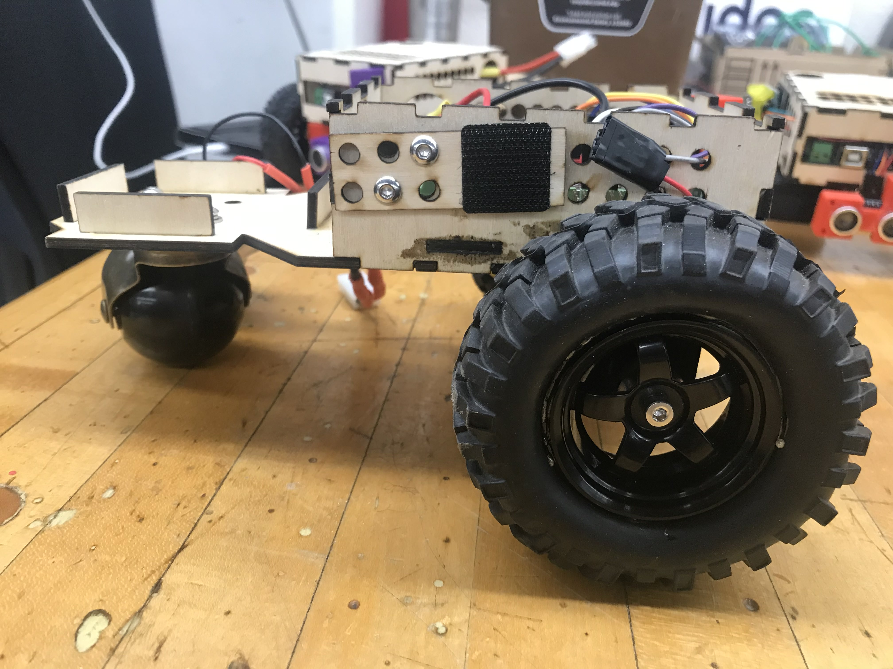
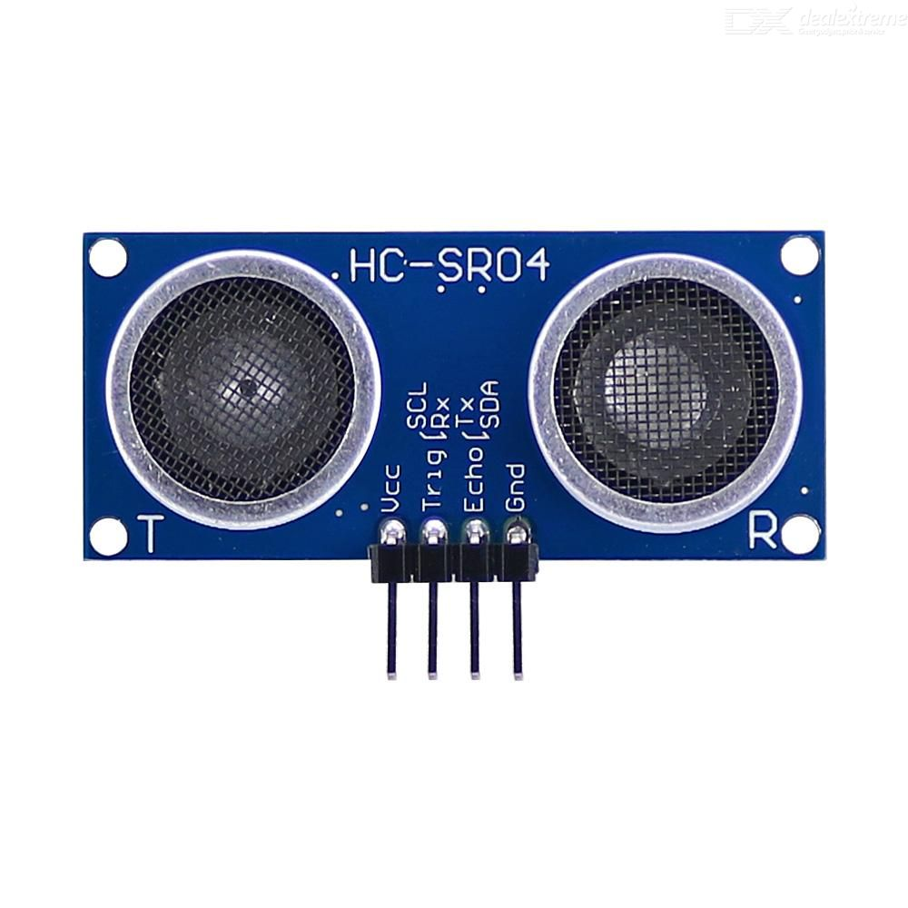
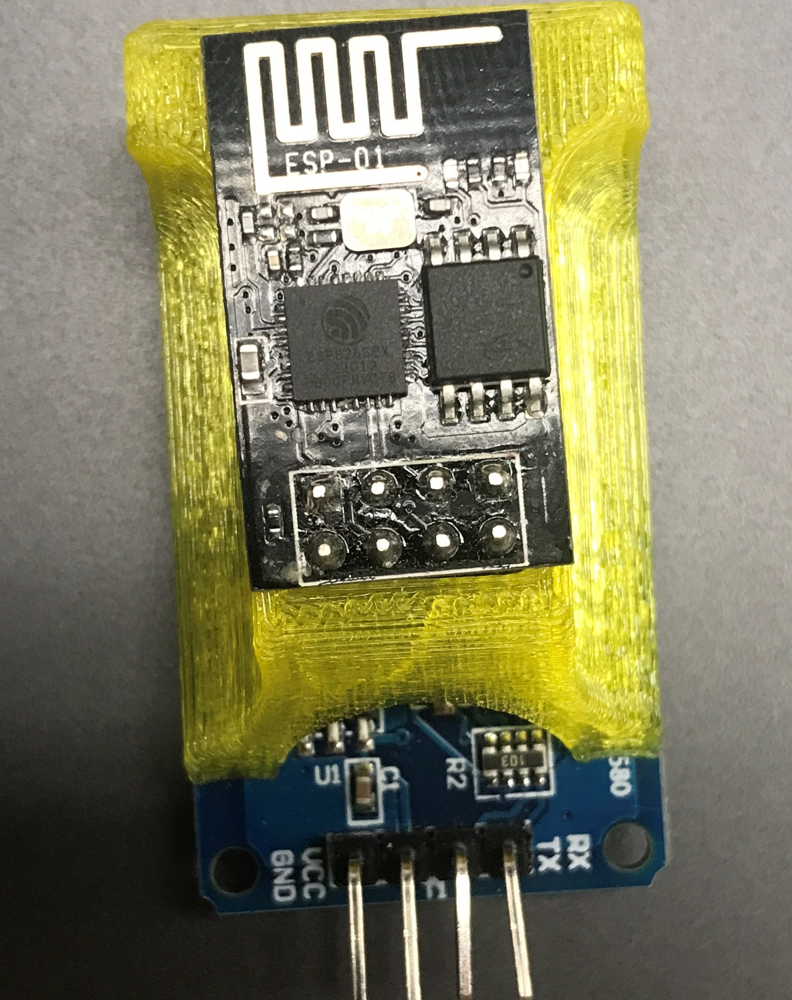

# Tank Arduino Library

The Tank arduino library is used on the simulator to control the motors on the simulator OSVs.

The library provides you access to the tank class, which can be used to control an OSV's motors. To configure your own motors to be compatible with this library, refer to the configuration section below. 

## Download and Installation

To download this library, click on the blue **Download** button on the right. Make sure the file is unzipped and move it to the arduino libraries folder (Documents->Arduino->libraries). You must have Arduino IDE version 1.5.0 or above. The most current version of Arduino IDE can be downloaded from the [Arduino website](https://www.arduino.cc/en/Main/Software).

**If you have an older version of the library on your computer, you _must_ delete it before adding a newer version.** Failure to do this may cause file conflicts and it is not guaranteed that the library will work properly.

## Usage

To use the library, you have to direct the compiler to include it in your code. Go to **Sketch > Include Library > Tank** , or add it manually by typing `#include "Tank.h"` at the top of your sketch.

To use the library, call `Tank.begin();` in the setup portion of the code. Now you are able to control the motors on the simulator.

## Functions

The following functions are available in the Tank library:

`Tank.begin()`
initializes the tank to be controlled.

`Tank.setLeftMotorPWM(pwm)`
sets the left motor pwms to the value passed as an argument.

`Tank.setRightMotorPWM(pwm)`
sets the right motor pwms to the value passed as an argument.

`Tank.turnOffMotors()`
sets the pwm of both motors to 0.

## Configuration
Note: You can ignore this section if you are not using the Tank library to control your physical motors.

Also note: A tank uses two or more wheels powered by two independent motors.

|**Motor**  |**Speed Pin**|**Direction Pin**|
|:---------:|:-----------:|:---------------:|
|Left Motor |      5      |         4       |
|Right Motor|      6      |         7       |


# TankCodeGuide
A readme on the pin connections of all tanks, how to upload code, and sample programs to help students get started.

# Hotrod-Tanks
Navigational tanks created to supplement student coding curriculum in ENES100.

<p align="left">
  
  
  
  <p> Figure 1 shows a general picture of a tank. They have swappable wheels to test out different ideas in prototyping.
Figure 2 shows how the tanks are wired internally. More detailed descriptions are given later on. Figure 3 shows where to place the 
wifi module on the tank.</p>
</p>


## Pin Connections
#### Romeo
A Romeo microcontroller is an arduino that contains an integrated H bridge to deliver power to the motors. The motors are connected to the motor A and motor B sockets. The motors are controlled by 4 pins that are prewired as the following:
   
- M1 = 4
- E1 = 5
- E2 = 6
- M2 = 7

The motor (M) pins control the direction the motors spin while the enable (E) pins control the speed. You will need to set these pins accordingly
to make the tanks move.

  

#### Ultrasonic Sensor
The ultrasonic sensor is useful for detecting obstacles immediately infront of the tank. It has 4 pin connections:
- Vcc = 5V
- Trig = 8
- Echo = 9
- Gnd = Gnd

  
  
  
#### Wifi Module
The wifi module helps connect to the vision system and deliver the current position of the aruco marker on your tank. More detailed information can be found on http://enes100.umd.edu/. It has 4 pin connections:
- Gnd = Gnd
- Vcc = 5V
- Tx = 10
- Rx = 11




## Coding the Tank
The side where the ultrasonic sensor sits is the front of the tank. The Upload port sticks out at the front; this is where you can upload your own code.

### Motor Code
To make the motors move forward you have to modify the enable and motor pins.
```
  //initializes or declares variables. Convention for hard coded values such as pins
  #define M1 4
  #define E1 5
  #define E2 6
  #define M2 7
  
  //define and int here do the same thing but since speed is a variable it is initialized using int
  int speed = 255; //Speed ranges from 0 to 255
  
  //only happens once
  void setup(){
  //loops through all 4 pins and dedicates them as outputs.
    for (int i = 4; i < 8; i++){
      pinMode(i, OUTPUT);
    }
  }
  
  //repeats forever unless end is specified
  void loop(){
    //calls function
    forward();
  }
  
  //creates a function to drive forward at full speed
  void forward(){
      //goes inside a function or the loop part
    analogWrite(E1, speed); // This puts the speed of motor 1 to 255
    digitalWrite(M1, HIGH); // This puts the spinning direction of the motor forward

    analogWrite(E2, speed); // Puts motor 2 speed to 255
    digitalWrite(M2, HIGH); // Puts motor 2 direction to forward
  }
```

### Ultrasonic Sensor Code
To code the ultrasonic sensor you can follow the code from the arduino website. This will give you the distance detected in centimeters.
```
// ---------------------------------------------------------------- //
// Arduino Ultrasoninc Sensor HC-SR04
// Sourced from https://create.arduino.cc/projecthub/abdularbi17/ultrasonic-sensor-hc-sr04-with-arduino-tutorial-327ff6
// ---------------------------------------------------------------- //

#define echoPin 9 // attach pin D2 Arduino to pin Echo of HC-SR04
#define trigPin 8 //attach pin D3 Arduino to pin Trig of HC-SR04

// defines variables
long duration; // variable for the duration of sound wave travel
int distance; // variable for the distance measurement

void setup() {
  pinMode(trigPin, OUTPUT); // Sets the trigPin as an OUTPUT
  pinMode(echoPin, INPUT); // Sets the echoPin as an INPUT
  Serial.begin(9600); // // Serial Communication is starting with 9600 of baudrate speed
  Serial.println("Ultrasonic Sensor HC-SR04 Test"); // print some text in Serial Monitor
  Serial.println("with Arduino UNO R3");
}
void loop() {
  getDistance();
}

void getDistance(){
  // Clears the trigPin condition
  digitalWrite(trigPin, LOW);
  delayMicroseconds(2);
  // Sets the trigPin HIGH (ACTIVE) for 10 microseconds
  digitalWrite(trigPin, HIGH);
  delayMicroseconds(10);
  digitalWrite(trigPin, LOW);
  // Reads the echoPin, returns the sound wave travel time in microseconds
  duration = pulseIn(echoPin, HIGH);
  // Calculating the distance
  distance = duration * 0.034 / 2; // Speed of sound wave divided by 2 (go and back)
  // Displays the distance on the Serial Monitor
  Serial.print("Distance: ");
  Serial.print(distance);
  Serial.println(" cm");
}
```
### Wifi Module code
To use the wifi module you will need to follow the instructions on http://enes100.umd.edu/libraries/enes100 to install the library and learn the basics. The following will get you to print the distance from the ultrasonic sensor onto the vision system rather than the serial monitor.

```
// ---------------------------------------------------------------- //
// Arduino Ultrasoninc Sensor HC-SR04 and Wifi Module code
// Using Arduino IDE 1.8.7
// Using HC-SR04 Module
// Tested on 17 September 2019
// ---------------------------------------------------------------- //

#include "Enes100.h" //libraries are included at the very top of the program

#define echoPin 9 // attach pin D2 Arduino to pin Echo of HC-SR04
#define trigPin 8 //attach pin D3 Arduino to pin Trig of HC-SR04
#define txPin 10
#define rxPin 11

// defines variables
long duration; // variable for the duration of sound wave travel
int distance; // variable for the distance measurement
int arucoID = 32; //you will have to check the aruco marker's number on the vision system

void setup() {
  Enes100.begin("LTF>UTF", FIRE, arucoID, txPin, rxPin);//starts the connection to the vision system. The parameters are (Name, Mission, Aruco Marker, Tx pin, Rx pin)

  pinMode(trigPin, OUTPUT); // Sets the trigPin as an OUTPUT
  pinMode(echoPin, INPUT); // Sets the echoPin as an INPUT
  
  Enes100.println("Ultrasonic Sensor HC-SR04 Test"); // print some text in Serial Monitor
  Enes100.println("with Arduino UNO R3");
}
void loop() {
  getDistance();
}

void getDistance(){
  // Clears the trigPin condition
  digitalWrite(trigPin, LOW);
  delayMicroseconds(2);
  // Sets the trigPin HIGH (ACTIVE) for 10 microseconds
  digitalWrite(trigPin, HIGH);
  delayMicroseconds(10);
  digitalWrite(trigPin, LOW);
  // Reads the echoPin, returns the sound wave travel time in microseconds
  duration = pulseIn(echoPin, HIGH);
  // Calculating the distance
  distance = duration * 0.034 / 2; // Speed of sound wave divided by 2 (go and back)
  // Notice that this now uses the wifi modules to print to the vision system.
  Enes100.print("Distance: ");
  Enes100.print(distance);
  Enes100.println(" cm");
}
```
## Coordinates and Movement Challenge: 
- Write an arduino program to get the coordinates of the aruco marker from the vision system. 
- Print it to the vision system.
- Use the ultrasonic sensor to detect obstacles and avoid them by turning.
- Use the location data from the vision system to find your way past the log or the limbo to the end.
- You can choose to do this however you like!
